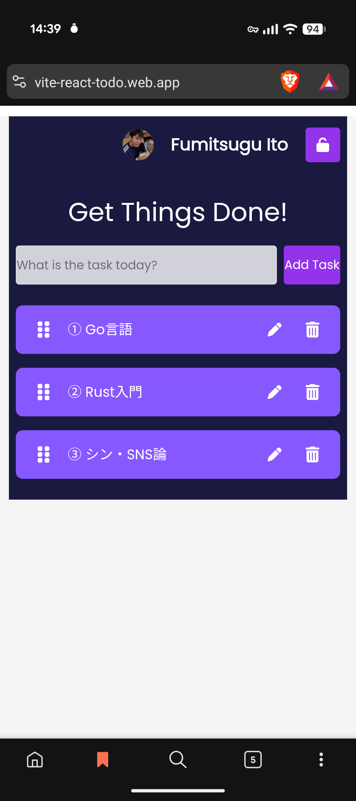
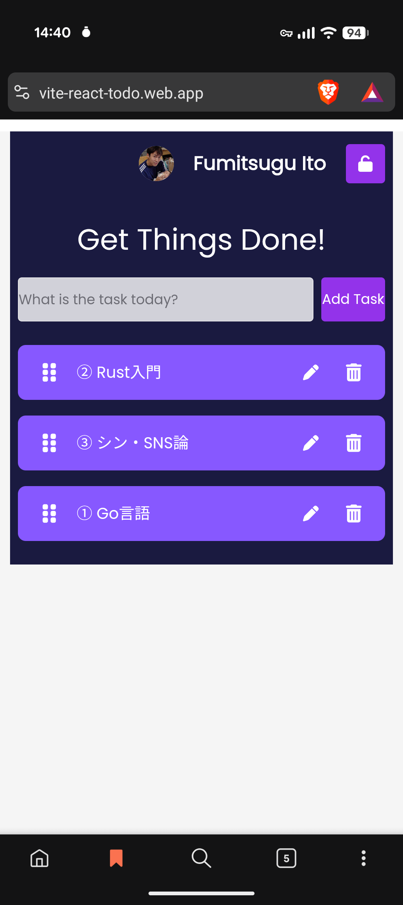
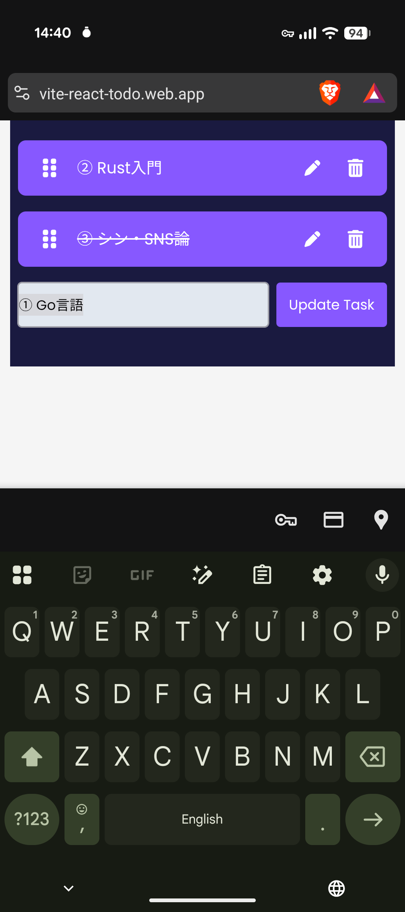
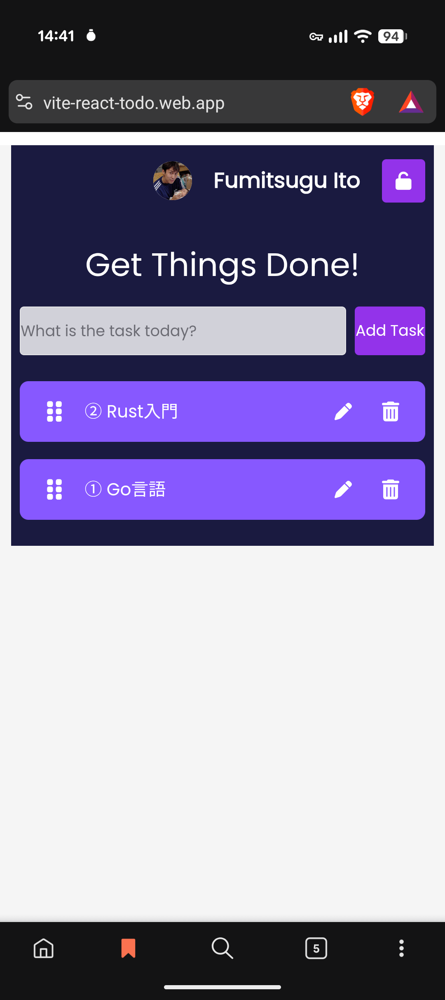

# Todo アプリ

Google アカウントでログインしたユーザーごとに Todo を作成・編集・完了切替・削除・ドラッグで並び替えできる SPA。Firestore に永続化され、同一アカウントで複数端末を開いていれば変更がリアルタイムに同期されます。

## 1. アプリ作成の背景・目的

React の勉強用に YouTube を見て作ったアプリを元に、

- TypeScript を使って作り直して TypeScript の勉強に
- Todo のデータをステートから Firestore に移して Web アプリ対応に
- Firebase Auth を使って認証実装の勉強に
- その他いろいろ思いついたことを実装して各種技術の勉強に

## 2. 使用技術一覧

### フロントエンド

- **React 19** / **TypeScript 5.7** (`strict`、`moduleResolution: bundler`)
- **Vite 6** — 開発サーバ (ポート 3001) / 本番ビルド
- **Chakra UI v3** (`@chakra-ui/react`) — UI コンポーネント。内部は **Emotion** (`@emotion/react`, `@emotion/styled`) で CSS-in-JS
- **Framer Motion** — アニメーション (Chakra v3 の依存)
- **FontAwesome** (`@fortawesome/*`) — 編集 / 削除 / 矢印 / ドラッグハンドル (`≡`) のアイコン
- **@dnd-kit** (`@dnd-kit/core` + `@dnd-kit/sortable` + `@dnd-kit/utilities`) — Todo リストのドラッグ並び替え。`PointerSensor` (5px 移動でドラッグ開始) / `TouchSensor` (150ms 長押しでドラッグ開始) / `KeyboardSensor` の 3 種に対応してモバイル可

### バックエンド / 認証

- **Firebase 11** (compat SDK 経由で Auth と Firestore を初期化)
- **Google OAuth** (`GoogleAuthProvider` + `signInWithPopup`)
- **react-firebase-hooks** — `useAuthState` で認証状態を React に購読
- Firebase 接続情報は `.env.local` の `VITE_apiKey` などの環境変数から注入

### テスト / Lint / Format

- **Jest 29** + `jest-environment-jsdom` + Testing Library (`@testing-library/react`, `user-event`, `jest-dom`)
- **ESLint 9** (flat config) — `typescript-eslint`, `eslint-plugin-react`, `react-hooks` v7, `jsx-a11y`, `react-refresh`
- **Prettier 3** + `eslint-config-prettier`

### ホスティング

- **Firebase Hosting** — `dist/` を配信。`firebase.json` で SPA 用に全パスを `/index.html` にリライト

## 3. 画面のスクリーンショット

### ① 通常の画面



### ② Todo アイテムを入れ替えた画面



### ③ Todo を完了したときの画面


### ④ Todo を編集中の画面



### ⑤ Todo を削除して①より1つ項目が減った画面



## 4. コンポーネント構成

```
src/
├── main.tsx              # エントリ。ChakraProvider で App をラップ
├── App.tsx               # ToDoWrapper を描画するシェル
├── App.css               # 全体の背景色など最低限のグローバル CSS
├── firebase.ts           # Firebase 初期化。db (Firestore) と auth を export
└── components/
    ├── ToDoWrapper.tsx   # Todo 状態管理 / Firestore CRUD / 認証ガード / DnD 並び替え
    ├── TodoForm.tsx      # 新規 Todo 入力フォーム
    ├── Todo.tsx          # 1 件表示 (≡ ドラッグハンドル / 完了切替 / 編集・削除ボタン)
    ├── EditTodoForm.tsx  # 編集フォーム (空入力時は Chakra Dialog で警告)
    ├── SignIn.tsx        # Google ログインボタン
    ├── SignOut.tsx       # ユーザー情報 + サインアウト
    └── __tests__/        # Jest + Testing Library テスト
```

- **状態管理の責務**: `ToDoWrapper` が `todos` ステートを一極集中で持ち、Firestore CRUD もここで実行する。子 (`Todo` / `EditTodoForm` / `TodoForm`) はハンドラを props で受け取って呼ぶだけのプレゼンテーション寄りの作り。
- **DnD**: `ToDoWrapper` の `DndContext` + `SortableContext` で囲み、`Todo` 側で `useSortable` を使って `transform` / `transition` を適用する。
- **認証ガード**: `useAuthState` で取得した `user` が `null` のときは `SignIn` のみ表示、ログイン後に Todo UI (`SignOut` + `TodoForm` + 各 `Todo`) を描画する。

## 5. Firebase の活用方法

### 認証 (Firebase Auth)

- **Google OAuth 単一プロバイダ構成**。`GoogleAuthProvider` を `signInWithPopup` でポップアップ認証
- `react-firebase-hooks` の `useAuthState` でログイン状態を React 側に購読し、未ログイン → `SignIn` 画面 / ログイン済み → Todo 画面 に出し分け
- Firebase 接続情報は `.env.local` の `VITE_apiKey` などの環境変数で注入し、コードにはハードコードしない

### データ永続化 (Firestore)

- コレクション **`todos`** に 1 件 1 ドキュメントで保存
  - `task: string` / `completed: boolean` / `isEditing: boolean` / `createdAt: serverTimestamp` / `uid: string` / `order: number`
- ドキュメント ID は `uuid` v4 でクライアント発行
- ユーザーをまたいで Todo が混ざらないよう、クエリ側で `where('uid', '==', currentUid)` でフィルタ

### 複数デバイスでのリアルタイム同期

- `db.collection('todos').where('uid', '==', currentUid).orderBy('order').limit(30).onSnapshot(...)` でコレクションを購読
- 同一の Google アカウントで PC とスマホを同時に開いていれば、片方で追加・編集・完了切替・並び替え・削除した変更が **もう片方の画面に即座に反映** される
- このクエリには Firestore の **複合インデックス `(uid Asc, order Asc)` が必須**。無いと `onSnapshot` が無言で失敗する (`code=failed-precondition`) ので、Firebase Console で事前に作成しておく
- `onSnapshot` のエラーコールバックで例外を `console.error` に出し、インデックス不足 / ルール拒否 / 認証切れの気付きを早めている

### ドラッグ並び替えの永続化

- 並び替え時は全ドキュメントの `order` を更新する必要があるため、`writeBatch` で 1 往復にまとめて書き込む
- 件数の上限を `.limit(30)` で抑えてあるので、batch update の負荷は軽い

### セキュリティ (Firestore Security Rules)

- `uid` スコープで owner のみ CRUD 可能
- `update` は **旧 / 新両方の `uid` が caller と一致** することを要求し、`uid` をすり替えて他人の Todo を奪う攻撃を防止

### ホスティング (Firebase Hosting)

- `npm run build` で生成される `dist/` を Firebase Hosting で配信
- `firebase.json` で SPA 用に全パスを `/index.html` にリライト (`react-router` 等の deep link 対応)
- 改良は `develop` ブランチで行い、リリース時に `main` から Firebase Hosting にデプロイする運用
